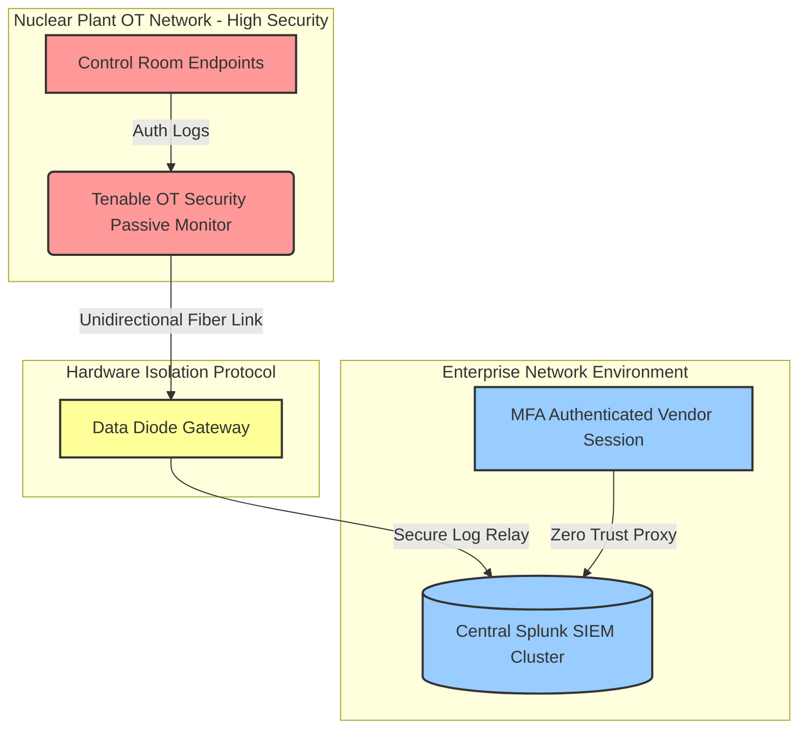

# ⚛️ Nuclear Cybersecurity Risk Framework & Portfolio Simulation

An advanced cybersecurity risk portfolio detailing critical infrastructure protections tailored to commercial clean energy and nuclear generation plants. This repository models cross-functional technical compliance tracking frameworks across Risk & Audits, Software Supply Chain Vetting, and Industrial BCDR Planning.

## 📜 Regulatory Standards Mapping
*   **10 CFR 73.54**: Protection of digital computer and communication systems.
*   **NRC RG 5.71 / NEI 08-09**: Nuclear Regulatory Commission frameworks for Critical Digital Assets (CDAs).
*   **NERC CIP**: Mandatory security controls for systems tied to the bulk electric infrastructure.
*   **NIST SP 800-53 & SP 800-82**: Security controls for federal IT systems and industrial Operational Technology (OT/ICS).

## 📁 Repository Structure
*   📊 `2026_assessment.csv`: Interactive threat gap matrix detailing asset scanning and software provenance deficiencies.
*   🗄️ `register.json`: Machine-readable risk ledger database scoring inherent versus residual risk metrics.

## 📐 Nuclear Architecture Data Diode & SIEM Flow

> *Architecture Note: This diagram outlines the unidirectional security boundary separating the high security nuclear plant OT environment from the corporate Splunk SIEM via hardware data diodes.*
