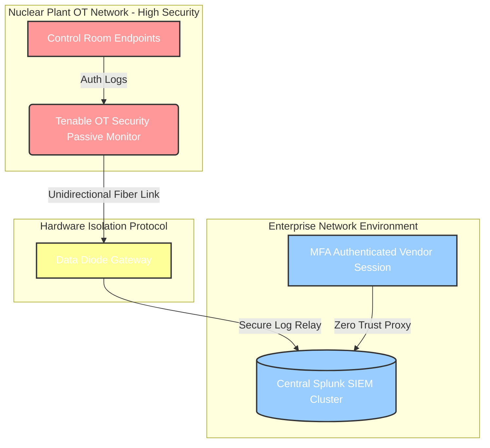

# ⚛️ Nuclear Cybersecurity Risk Framework & Portfolio Simulation

An advanced cybersecurity risk portfolio detailing critical infrastructure protections tailored to commercial clean energy and nuclear generation plants. This repository models cross functional technical compliance tracking frameworks across Risk & Audits, Software Supply Chain Vetting, and Industrial BCDR Planning.

## 📜 Regulatory Standards Mapping
*   **10 CFR 73.54**: Protection of digital computer and communication systems.
*   **NRC RG 5.71 / NEI 08-09**: Nuclear Regulatory Commission frameworks for Critical Digital Assets (CDAs).
*   **NERC CIP**: Mandatory security controls for systems tied to the bulk electric infrastructure.
*   **NIST SP 800-53 & SP 800-82**: Security controls for federal IT systems and industrial Operational Technology (OT/ICS).

## 📁 Repository Structure
*   📊 `2026_assessment.csv`: Interactive threat gap matrix detailing asset scanning and software provenance deficiencies.
*   🗄️ `register.json`: Machine readable risk ledger database scoring inherent versus residual risk metrics.

*  📋 `vendor_caiq_assessment.csv` : A structured Vendor Security Assessment modeled after industry standard Consensus Assessments Initiative Questionnaires (CAIQ).
*  📉 `dr_emergency_strategy.md`: A technical strategy blueprint detailing data replication tiers and automated failover pipelines.

## 📐 Nuclear Architecture Data Diode & SIEM Flow

Unidirectional Telemetry & SIEM Aggregation: To satisfy NRC requirements preventing any external remote intrusion, the architecture enforces a strict hardware isolation boundary. The Tenable OT Security Passive Monitor captures deep packet telemetry and auth logs from the high security reactor control endpoints without injecting active probes. This data is transmitted outward through a Data Diode Gateway via a physical unidirectional fiber link, ensuring zero inbound return path. On the corporate side, a secure log relay uses a Zero Trust Proxy to ingest the traffic into the Central Splunk SIEM Cluster for continuous cross-zone threat correlation, anomaly detection, and incident response tracking all without compromising plant safety.

## 🕵️‍♂️ Research Methodology & Source Validation
This section outlines the public data curation workflow:

### 1. Source Discovery & Regulatory Aggregation
*   **Nuclear Digital Controls (10 CFR 73.54)**: Sourced directly from the official **U.S. Nuclear Regulatory Commission (NRC)** public document collections. This rule mandates that cyber attacks cannot cause radiological sabotage or compromise safety-related plant functions.
*   **Bulk Electric Protections (NERC CIP)**: Core guidelines extracted from the open **North American Electric Reliability Corporation (NERC)** standards library. Focus was placed specifically on **CIP-008-6** (Incident Reporting) and **CIP-013-3** (Supply Chain Risk Management) to address modern third party software vulnerability threats.
*   **Industrial Control Guidance (NIST SP 800-82)**: Cross-referenced with the **National Institute of Standards and Technology** open source SP 800-82 guide, specifically analyzing security architectures for air gapped zones and unidirectional data flows.

### 2. Operational Translation Process (Real-World Application)
To apply these massive federal documents to a simulated clean energy tech environment, the following real world implementation logic was used:
*   **Step A: Asset Identification**: Before applying controls, assets are categorized as either **Information Technology (IT)** or **Critical Digital Assets (CDAs)** in the Operational Technology (OT) domain. 
*   **Step B: Flow Isolation via Data Diodes**: To satisfy NRC requirements that plant data cannot be maliciously modified from the outside, the architecture implements a physical hardware **Data Diode**. This allows real time health telemetry to flow outward to an enterprise **Splunk SIEM** for analysis, but physically blocks inbound packets from entering the reactor control network.
*   **Step C: Supply Chain Ingestion (SBOMs)**: To address NERC CIP-013 requirements, vendor software is passed through an automated dependency analysis pipeline to evaluate its **Software Bill of Materials (SBOM)** before deployment, shifting third party risk analysis from a paperwork exercise to a technical review.
