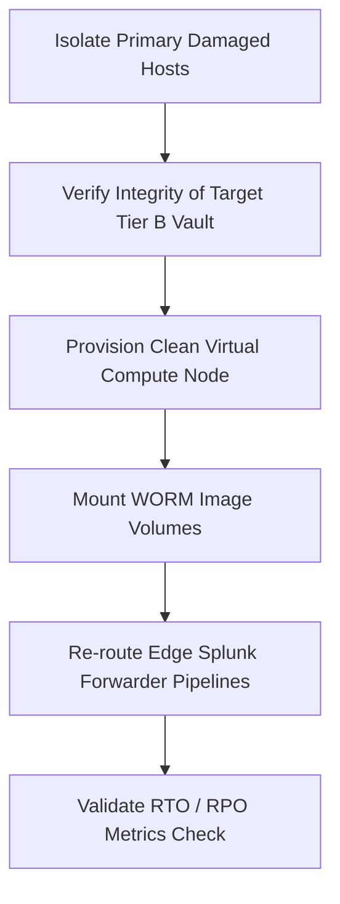

# 📉 IT Disaster Recovery Strategy: Emergency Data Processing
*   **Regulatory Alignment**: NERC CIP-009-6 (Recovery Plans for BES Cyber Systems), NIST SP 800-34
*   **Classification**: Internal Simulation Framework

---

## ⚡ 1. Primary Disaster Triggers
This strategy document outlines execution procedures when primary database engines or processing clusters experience a catastrophic outage due to:
*   **Severity 1 Cyber Incident**: Active system ransomware encryption.
*   **Critical Hardware Failure**: Power or local array controller faults disrupting real-time transaction states.

## 💾 2. Emergency Backup & Replication Tiers
To guarantee data availability, production infrastructure mirrors logs across isolated storage tiers:

### 🟢 Tier A: Active Replicas (Hot Standby)
*   **Storage Pool**: Network-isolated, alternate zone server cluster.
*   **Replication Type**: Near real-time synchronous block replication.
*   **Objective**: Zero data loss path for immediate failover.

### 🟡 Tier B: Immutable Cold Backups (Air-Gapped Vault)
*   **Storage Pool**: Offline, write-once-read-many (WORM) storage architecture.
*   **Replication Type**: Daily snapshot export via hardware-controlled network breaks.
*   **Objective**: Final protection layer against lateral ransomware propagation.

---

## 🚀 3. Failover Execution Workflow
When a system failover is declared by the incident manager, infrastructure teams must execute remediation sequentially:

1.  **Isolation**: Terminate network routing vectors connected to the compromised production host.
2.  **Verification**: Audit cryptographic hashes of the cold storage vault file images to confirm image validity.
3.  **Provisioning**: Deploy clean instance snapshots onto trusted, isolated cloud or data center hypervisors.
4.  **Mounting**: Connect the validated backup volumes onto the clean server instance.
5.  **Re-routing**: Adjust local DNS and **Splunk forwarder configurations** (`outputs.conf`) to target the new emergency cluster endpoint.
6.  **Validation**: Confirm that the operational **RTO (< 2 Hours)** and **RPO (< 15 Minutes)** limits conform to active safety mandates.
